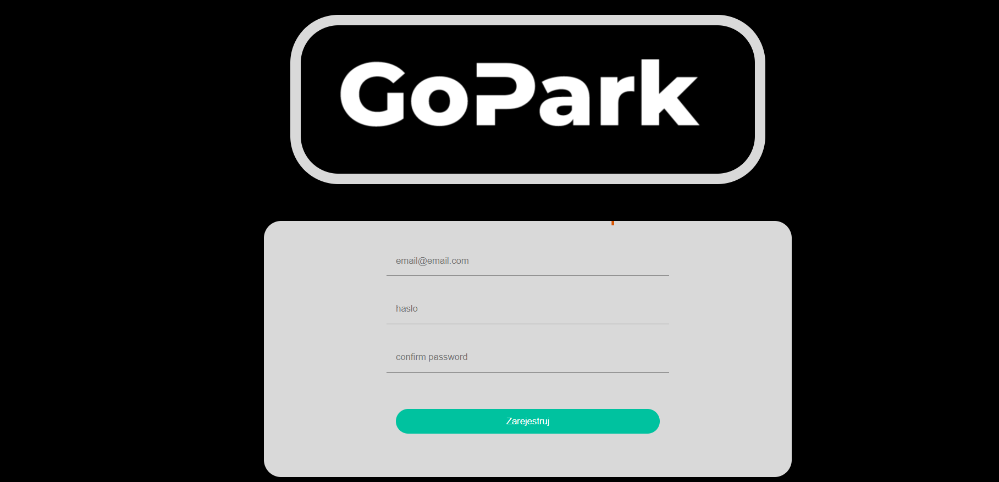
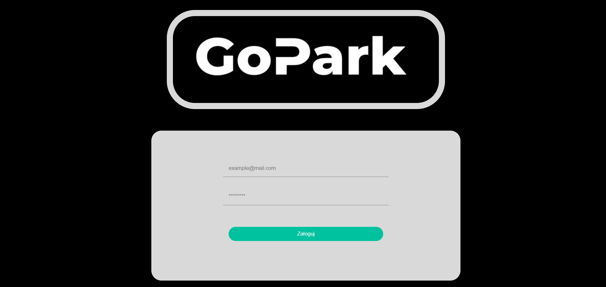
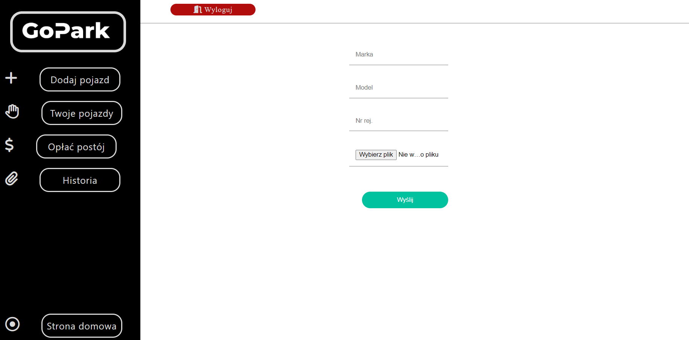
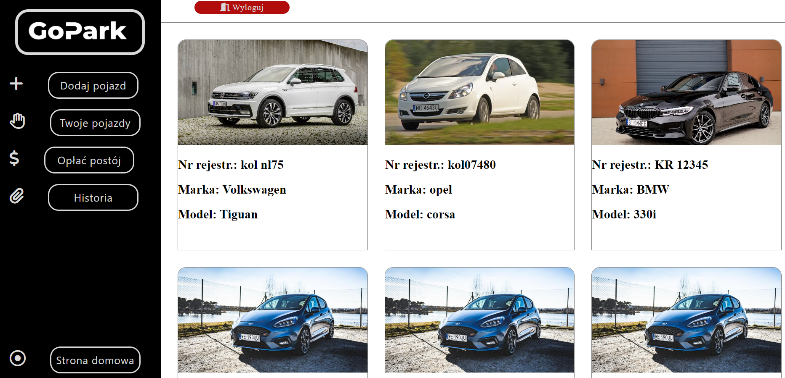
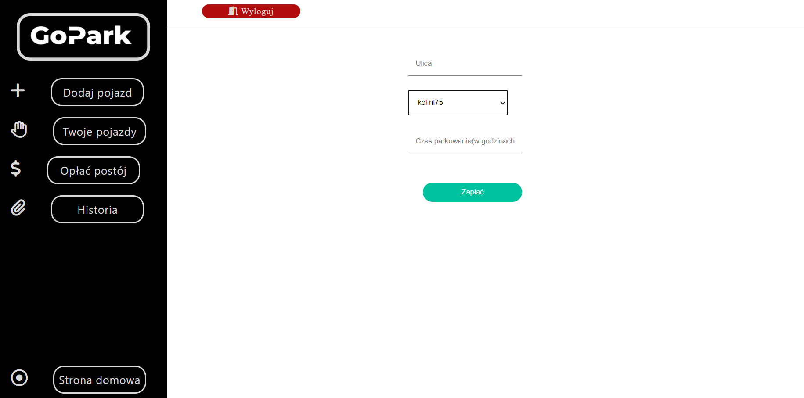
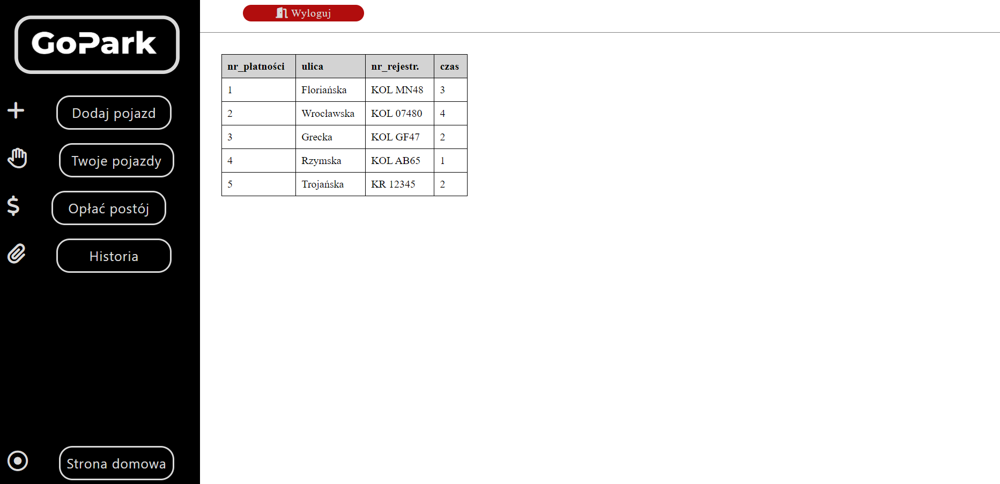

# GOPARK

Website for paying your parking tickets.

## Table of contents

* [About website](#about-website)
* [Technologies Used](#technologies-used)
* [Features](#features)
* [Screenshots](#screenshots)
* [Launch](#launch)
* [Acknowledgements](#acknowledgements)

## About website
With this page you can pay for all your parking tickets without that irritating parking meters' searching. 

## Technologies Used
* Frontend
* * HTML
* * CSS
* * JAVASCRIPT

* Backend
* * PHP

* Other
* * GIT
* * DOCKER
* * NGINX

## Features

These are the most important features:
- You can add your car to database.
- You can pay with this app for ticket.
- You don't have to manually type registration number.

## Screenshots
There are some screenshots from my website.

## Launch

To run this project you need to have Docker app and some IDE like visual studio code or webstorm. First you need to run Docker app. Then in the IDE terminal you need to write 'docker-compose up'. The last thing you have to do is open your browser and enter 'localhost:8080' in the search bar.

## Acknowldgements
* This project was made in the course Introduction to Web Application Design.
* Thanks to Adrian Widłak for given materials and overseeing all projects.